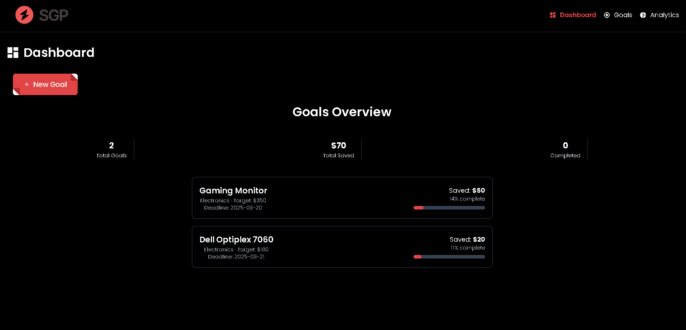

#  Smart Goal Planner

A modern React web application for managing and tracking personal savings goals. This project demonstrates core React concepts, persistent CRUD operations, and a clean, responsive UI for a school assignment.

## Preview


- <small>This is a preview of the Smart Goal Planner application Dashboard, showcasing its clean and modern UI.</small>

## Project Description

Smart Goal Planner allows users to:
- Create, edit, and delete multiple savings goals
- Track progress visually for each goal
- Categorize goals (e.g., Travel, Emergency, Electronics, etc.)
- Set deadlines and receive visual warnings for approaching or overdue goals
- View analytics and summary statistics for all goals
- Persist all data using a REST API powered by JSON Server and a `db.json` file

The app is designed to showcase React fundamentals (state, props, effects, forms, API calls) and practical UI/UX for personal finance management.

## Features Implemented

- **Goal Management:** Full CRUD (Create, Read, Update, Delete) for savings goals
- **Progress Tracking:** Visual progress bars and completion status for each goal
- **Category & Deadline:** Assign categories and deadlines, with warnings for deadlines within 30 days or overdue
- **Analytics Dashboard:** Summary of total saved, completed goals, and category breakdown
- **Persistent Storage:** All data is stored in `db.json` and accessed via REST API endpoints
- **Responsive Design:** Mobile-friendly layouts using Tailwind CSS
- **Modern UI:** Clean, neumorphic-inspired components and interactive modals

## Technology Stack

- React 19 (with hooks)
- Vite (build tool)
- Tailwind CSS (styling)
- JSON Server (mock REST API)
- Chart.js (analytics visualization) to be implemented
- JavaScript (ES6+)

## File Structure

```
Frontend/
├── src/
│   ├── components/
│   │   ├── App.jsx           # Main app logic and state
│   │   ├── Dashboard.jsx     # Overview and statistics
│   │   ├── GoalForm.jsx      # Create/edit goals
│   │   ├── GoalCard.jsx      # Display individual goal
│   │   ├── Analytics.jsx     # Analytics and charts
│   │   └── ProgressBar.jsx   # Visual progress bar
│   ├── App.css
│   ├── index.css
│   └── main.jsx
├── package.json
├── vite.config.js            # Vite configuration
README.md
Backend/
└── db.json                   # Persistent data storage (JSON Server)
└── package.json
```

## Implementation Summary

- **State Management:** Uses `useState` and `useEffect` for managing and fetching goal data.
- **API Integration:** All CRUD operations are performed via fetch requests to `/goals` endpoints provided by JSON Server.
- **Component Design:** UI is broken into reusable components for clarity and maintainability.
- **Data Persistence:** All changes are reflected in `db.json`, ensuring data is not lost on refresh.
- **Analytics:** Real-time calculations and visualizations for user savings progress.
- **Styling:** Tailwind CSS for rapid, responsive, and modern design.

## What Was Built

- A fully functional savings goal planner with persistent backend
- Clean, simple, and responsive UI suitable for a school project
- Demonstration of React best practices and integration with a REST API
- All code and data structures are organized for clarity and easy grading

## Backend Setup Manual (JSON Server)

### Local Development

1. **Install JSON Server**
   - In your project directory, run:
     ```bash
     npm install json-server --save-dev
     ```
   - Or globally (optional):
     ```bash
     npm install -g json-server
     ```

2. **Prepare db.json**
   - Ensure your `db.json` file is at the project root (or as referenced in your scripts).
   - Example structure:
     ```json
     {
       "goals": []
     }
     ```

3. **Add a start script (optional but recommended)**
   - In your `package.json` scripts section:
     ```json
     "scripts": {
       ...,
       "json-server": "json-server --watch db.json --port 3001"
     }
     ```

4. **Start the backend server**
   - Run:
     ```bash
     npm run json-server
     ```
   - The API will be available at `http://localhost:3001/goals`

### Deployment (e.g., Render)

1. **Deploy as a Web Service**
   - Push your code (including `db.json` and `package.json`) to a Git repo.
   - On Render, create a new Web Service from your repo.
   - Set the start command to:
     ```bash
     npx json-server --watch db.json --port 10000
     ```
     (Choose a port Render allows, e.g., 10000)
   - Set the build command to `npm install`.

2. **Update Frontend API URL**
   - In your React app, set the API URL to your Render backend URL, e.g.:
     ```js
     const API_URL = 'https://your-backend.onrender.com/goals';
     ```
   - Use environment variables for local/production switching if needed.

3. **Data Persistence**
   - All changes (POST, PUT, DELETE) will be saved in `db.json` on the server.

---

*Built as a demonstration of React fundamentals, CRUD operations, and practical UI/UX for personal finance.*
